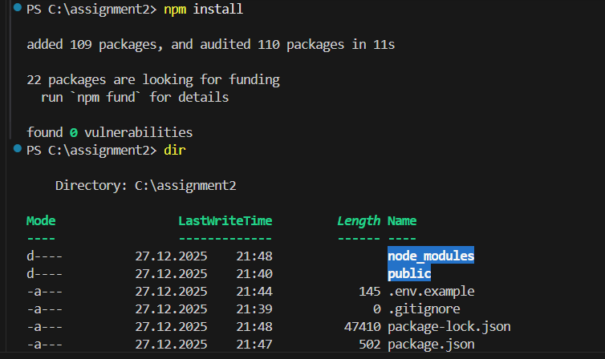
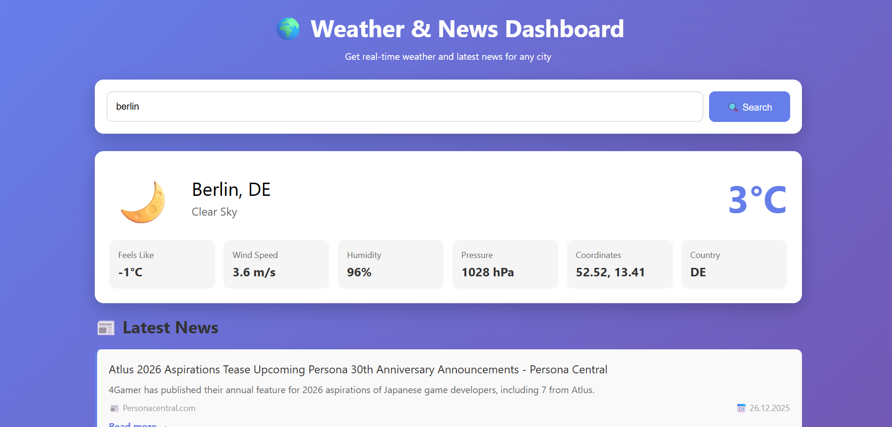
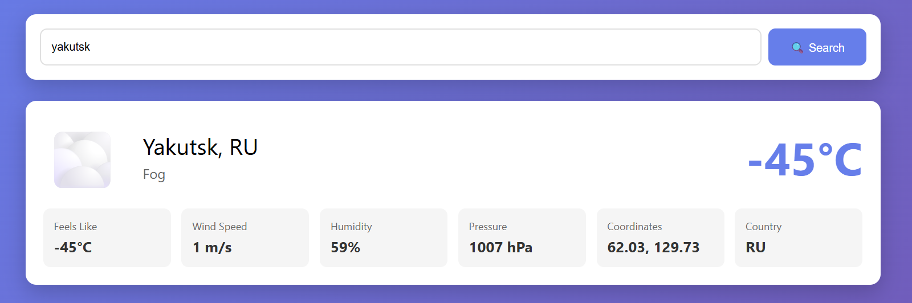

# Nurlan Ramazan
# Group: SE-2431

## Project Description

This is my backend API integration project where I built a full-stack web application that combines real-time weather data and latest news articles. The application allows users to search for any city and instantly see current weather conditions along with related news, all processed through a secure backend server.


## APIs Integrated


**API Endpoint**: `https://api.openweathermap.org/`

### 2. News API (Additional API)
Displays the latest news articles related to the searched city or region.
- Top headlines by country
- Article titles and descriptions
- Publication date and source
- Direct links to full articles

**API Endpoint**: `https://newsapi.org/`


### Install Dependencies
Open terminal in the project folder and run:
```bash
npm install
```

This installs:
- `express` - Web framework for Node.js
- `axios` - Promise-based HTTP client
- `dotenv` - Environment variable loader
- `cors` - Cross-Origin Resource Sharing middleware




**Where to get API keys:**
- OpenWeather: [https://openweathermap.org/api](https://openweathermap.org/api)
- News API: [https://newsapi.org/](https://newsapi.org/)

### Start the Server
```bash
npm start
```

The server will run on `http://localhost:3000`


## API Endpoints

### Weather Data
```
GET /api/weather?city={cityName}
```

**Example Request:**
```
GET http://localhost:3000/api/weather?city=London
```

**Example Response:**


### Combined Data
```
GET /api/all?city={cityName}
```

Returns both weather and news in a single request for better performance.

### Server Status
```
GET /api/status
```

Returns server health status and API key configuration.

## Key Design Decisions

### 1. Architecture
All API requests are processed on the server side for several reasons:
- **Security**: API keys are never exposed to the frontend
- **Performance**: Server can handle rate limiting and caching
- **Error Handling**: Centralized error management
- **Data Processing**: Clean and format data before sending to client


### 2. User Experience
- Default city loads automatically (Astana)
- Real-time loading indicators
- Weather icons based on conditions
- Color-coded weather cards
- Clickable news links opening in new tabs
- Hover effects for better interactivity

## Screenshots

### Main Dashboard


The main page shows the search bar and welcomes users with the default city (Astana).

### Weather Display


Weather card displays all required information: temperature, feels-like, wind speed, humidity, pressure, coordinates, and country code.

### News Section


News articles are displayed with titles, descriptions, sources, and publication dates.

## What I Learned

Through this project, I gained experience in:
- Setting up Node.js and Express servers
- Integrating multiple third-party APIs
- Server-side request handling
- Environment variable management
- Responsive web design principles
- Error handling and validation
- Asynchronous JavaScript (async/await)
- API documentation and testing
- Project structure organization

## Future Improvements

If I had more time, I would add:
- City autocomplete search
- Weather forecast (5-day prediction)
- Save favorite cities
- Dark mode toggle
- Charts for weather trends
- More news categories
- Caching to reduce API calls
- User location detection


## Conclusion

This project successfully demonstrates backend API integration and full-stack development skills. Both Weather and News APIs are properly integrated on the server side, data is processed and displayed in a user-friendly interface, and the application follows best practices for code organization and error handling. The responsive design ensures the application works well on all devices.
